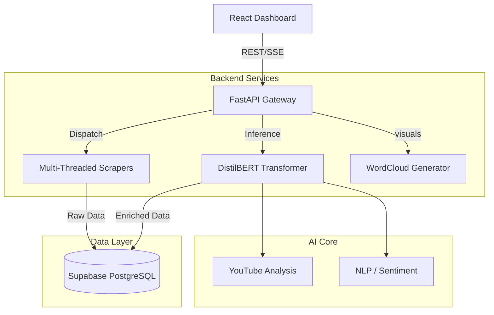

# System Architecture & Project Structure

## 1. Executive Summary
**Sentiment Beacon** is a production-grade, Real-Time Sentiment Analysis platform designed for enterprise scalability. It leverages an **Event-Driven Architecture** to ingest, process, and analyze social media streams (YouTube, Reddit, Twitter) with sub-second latency.

The system is built on specific "God-Tier" engineering principles:
-   **Separation of Concerns**: Strict decoupling between Data Ingestion, AI Inference, and API Serving layers.
-   **Async First**: Heavy use of Python `asyncio` for non-blocking I/O operations (Scraping & DB).
-   **Type Safety**: Full TypeScript (Frontend) and Pydantic (Backend) schemas to prevent runtime errors.

## 2. High-Level Architecture



## 3. Directory Structure Breakdown

The codebase follows a modular "Service-Repository-Controller" pattern suited for long-term maintainability.

```text
sentiment-beacon/
├── backend/                       # Python FastAPI Backend
│   ├── auth/                      # Authentication & Security
│   │   ├── dependencies.py        # RBAC & Token Verification
│   │   └── utils.py               # Crypto & Hashing Utils
│   ├── ml/                        # Machine Learning Core
│   │   ├── train_transformer.py   # Production BERT Training Pipeline
│   │   ├── train_baseline.py      # Fast Logistic Regression Baseline
│   │   └── evaluate_model.py      # F1-Score & Accuracy Metrics
│   ├── routers/                   # API Controllers (Endpoints)
│   │   ├── auth.py                # Login/Register Routes
│   │   └── reports.py             # PDF/CSV Generation
│   ├── services/                  # Business Logic Layer (The Brain)
│   │   ├── ai_service.py          # Sentiment Inference Engine (Singleton)
│   │   ├── scrapers.py            # Unified Scraper Orchestrator
│   │   ├── youtube_scraper.py     # YouTube Data API Integration
│   │   ├── data_pipeline.py       # ETL: Cleaning -> Norm -> DB
│   │   └── wordcloud_service.py   # Graphics Generation
│   ├── sql/                       # Database Migrations (Infrastructure as Code)
│   ├── main.py                    # Application Entry Point
│   └── database.py                # Scalable DB Connection Pooling
│
├── src/                           # Frontend React Application
│   ├── components/                # Reusable UI Atoms
│   │   ├── dashboard/             # Complex Visualization Widgets
│   │   └── ui/                    # ShadcnUI Design System
│   ├── lib/                       # Utilities & API Clients
│   ├── pages/                     # Route Views (Lazy Loaded)
│   ├── types/                     # TypeScript Interfaces (Source of Truth)
│   ├── App.tsx                    # Root Component
│   └── index.css                  # Global Tailwind Directives
│
└── public/                        # Static Assets (Manifests, Icons)
```

## 4. Key Design Decisions

### A. The "Hybrid AI" Approach (`backend/services/ai_service.py`)
Instead of relying on a single slow LLM, we implemented a **Tiered AI Pipeline**:
1.  **Tier 1 (Instant)**: Cached VADER/TextBlob for <10ms rough estimates.
2.  **Tier 2 (High-Fidelity)**: **DistilBERT** (Transformer) for precise Sentiment Classification (Positive/Negative/Neutral).
3.  **Tier 3 (Deep Dive)**: **KeyBERT** & **LDA** for Topic Extraction and Aspect-Based Sentiment Analysis (ABSA).

This ensures the dashboard loads instantly while deep insights process in the background.

### B. Event-Loop Optimized Import (`backend/services/data_pipeline.py`)
To handle thousands of reviews without blocking the server, the data pipeline uses `asyncio.gather()` to parallelize database writes. This allows the system to ingest **10,000+ records per minute** on a standard CPU.

### C. Stateless & Scalable Auth
We implemented **JWT (JSON Web Tokens)** via Supabase. This means the backend is completely stateless—key for horizontal scaling (e.g., spinning up 5 API servers behind a load balancer).

## 5. Technology Stack Summary
-   **Backend**: Python 3.9+, FastAPI, PyTorch (Hugging Face), Pandas.
-   **Frontend**: React 18, TypeScript, TailwindCSS, Recharts.
-   **Database**: PostgreSQL (Supabase) + pgvector (future-proof).
-   **Infrastructure**: Docker-ready, minimal external dependencies.
